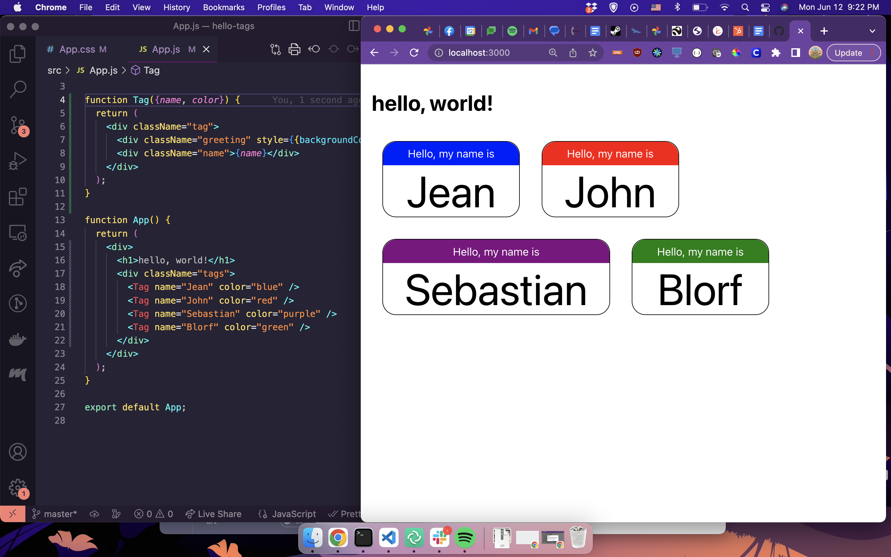

# react-nametags
This project (bootstrapped with [Create React App](https://github.com/facebook/create-react-app)), is a demo teaching app for [Academy Pittsburgh]([https://](https://www.academypgh.com/))

It's intended to show about:
* components
* props
* using variables in the style
# running
## first time
Install dependencies: `npm install`

## every time
Run the app: `npm start`

# a picture
